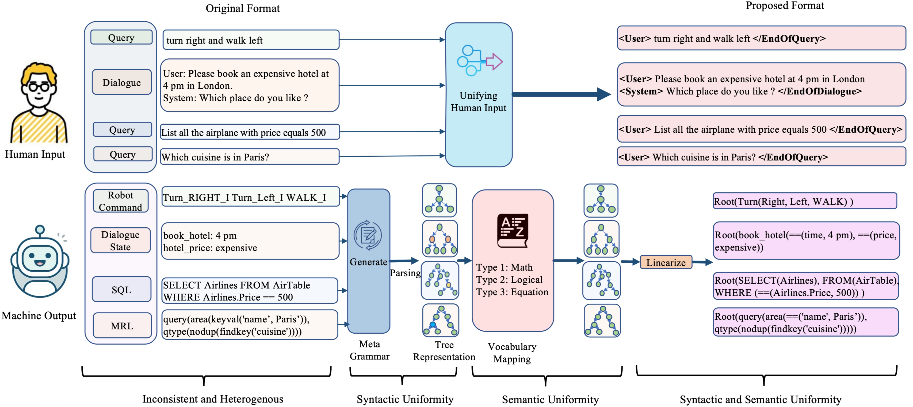

# Uniform semantics for Semantic Parsing and Task-Oriented Dialogue Systems
This is the repository for the paper Syntactic and Semantic Uniformity for Semantic Parsing and Task-Oriented Dialogue Systems (EMNLP Findings 2022)

## Introduction

For now, you can find the implemented models are the Transformer model and LSTM with Copy mechanism which you can use directly to get some initial results. In conclusion, the paper's key idea is a framework to unify different semantics of different machine-readable formats in Semantic Parsing and Task-Oriented Dialgoue. Performance is not the main focus of this paper.
If you are interested in this research, you can refer to the [paper](https://aclanthology.org/2022.findings-emnlp.60/) for detail.
## Datasets
Current datasets covered in the repository are:  
1. Semantic Parsing
  - GeoQuery-FunQL Version
  - GeoQuery-SQL Version
  - SCAN-Si & Scan-Len
  - SParC
  - Spider
  - NLmaps v2
  - ATIS-SQL Version
2. Task-Oriented Dialogue
  - TreeDST
  - SMCalFlow
  - CoSQL
  - MultiWoz
  - M2M
  - DSTC2

<!---Some datasets are beyond the limit of GitHub's storage, so I uploaded some of the datasets in the [Google Drive](https://drive.google.com/file/d/1Bxm29zjtLkLiuzMNHMUAIWmOSvBWlGu6/view?usp=sharing), you could download these datasets via this link and unzip it, then place each dataset to the corresponding folder. Since some datasets have been updated, if you downloaded these datasets before 2022.02.23, you should re-download them.-->

## Codes for Producing Proposed Format and New Task Processing
To obtain the format proposed in the paper, you need to have the following additional packages:  
Please refer to the code `sem4diag_rewriting.py` which contains the processing script we used for different formats of different datasets, but to make the script work, you may need some of the following packages:  
 - `mo_sql_parsing` for SQL language parsing  
 - `pyparsing` for nested parenthesis Parsing  
 - `anytree` and `treelib` for tree representation  
 - `onmt` for some default special tokens  

### For New Task Processing
You need to add your parsing code if:
 - your data is not in the format that the script can be used to process directly which contains SQL Query, FunQL Query, Dialogue States, NLmaps, etc.

If your data is not listed in the above format, you will need to add new code to parse your data and linearize the tree based on the method we used in the paper. However, the code may not need to be completely rewritten, this is mostly case by case, you may be able to reuse some parts of the code.  

This choice largely depends on the nature of your data. Therefore, use the code in the repository in a careful manner. Since the code may not apply to your format and you may need to write your own.  
## Codes for Experiments

### File Introduction
Each dataset folder contains the following files:
  - `processe_xxx.py` this is the pre-process code of each dataset, use this to do pre-processing.
  - `processed_xxx` folder, this folder is for pre-processed datasets.
  - `vocab_xxx` folder, this folder contains the vocabulary file of each dataset
  - other folders besides the above folders are mainly the raw data of each dataset.  

Each dataset contains a YAML configuration file like `SCAN.yaml` or `GeoQuery.yaml`, these files specify configurations like the parameter setting and model setting of each dataset, this YAML file is based on the [OpenNMT package](https://github.com/OpenNMT/OpenNMT-py), you should refer to this package to know the usage of the YAML configuration file.

The `utils` folder contains necessary metric codes. The `metric_test.py` is built upon this folder. Current metrics contain the following:
  - Word Level Exact Match
  - Sentence Level Exact Match
  - BLEU Score, BLEU metric is built upon [screbleu package](https://github.com/mjpost/sacrebleu), you should also install this package.

This repository also supports SQL execution evaluation, which is a part of the [test-suite-sql-eval](https://github.com/taoyds/test-suite-sql-eval), but the code of this repository is somehow problematic, so I modified some of the codes, therefore you should not use the code in that repository. However, to run the SQL evaluation code, you need to download the SQL database for different datasets, which is at [Google Drive](https://drive.google.com/file/d/1mkCx2GOFIqNesD4y8TDAO1yX1QZORP5w/view). Download this database and unzip it into the `sql_eval` directory, for detail on how to use this code, please refer to the original repository. This repository is also the official metric repository for CoSQL, Sparc, and Spider datasets.

For the official metric of the SMCalFlow dataset, you should refer to its [repository](https://microsoft.github.io/task_oriented_dialogue_as_dataflow_synthesis/) for the details about how to evaluate it with the official metric.

`train.sh` contains the training script, it contains the following functions:
  - train the model
  - translate the given source input
  - evaluate the model output

### Running the code
It is relatively easy to run the code, for example, if you want to run an experiment in the GeoQuery dataset using the Transformer model and evaluate the model trained with 10000 steps, your training command should be like this:

```sh train.sh GeoQuery Transformer 10000```

You should refer to train.sh for detail on acceptable parameters of the `train.sh`.

If you want to use another model, changing the model parameter of the `train.sh` does not automatically choose the model to run. Before you train the model, you should modify the YAML file of each task to change the model selection. For example, if you want to use the LSTM model in GeoQuery, you should comment on the Transformer setting in the `GeoQuery.YAML` and uncomment the LSTM setting. Otherwise, even if you input ```sh train.sh GeoQuery LSTM 10000```, it will still train a Transformer model. For details about the YAML configuration, refer to the [OpenNMT](https://github.com/OpenNMT/OpenNMT-py).

The last numeric parameter specifies the model of a particular step as the evaluation model. For the above example program, it uses Transformer trained at 10000 steps as the model for evaluation. It will automatically translate the test file and evaluate the translated test file with the gold file. The results will be reported after the evaluation is finished. However, the automatic evaluation only supports Word EM, Sent EM, and BLEU score, if you want to execute SQL query in the database, refer to [test-suite-sql-eval](https://github.com/taoyds/test-suite-sql-eval) for detail, in conclusion, the SQL execution accuracy is not automatically reported, you should run it by yourself.

